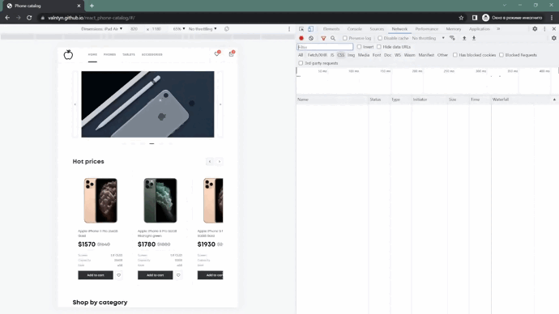
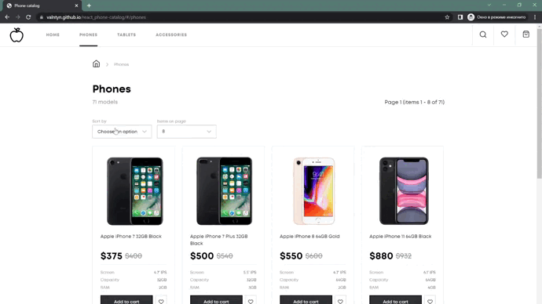
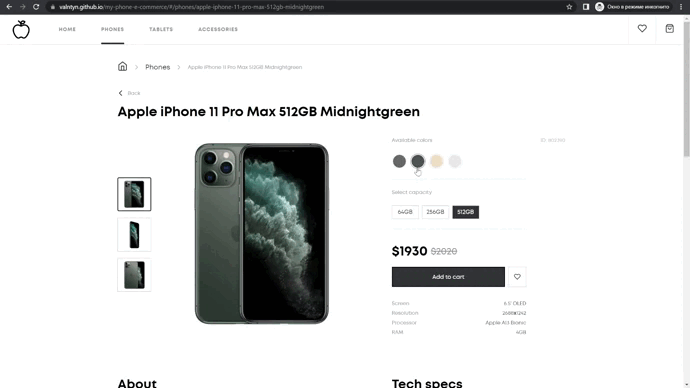
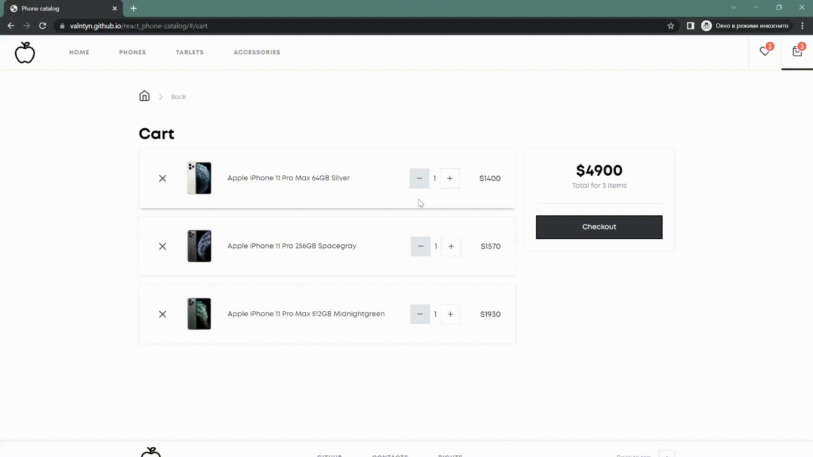

# E-commerce store
  In this project, I have created a functional e-commerce website where users can browse products, add them to their cart, 
  add to their favorite list, searching, and filter.
  
  Please, check the demo page of app --- [DEMO](https://valntyn.github.io/my-phone-e-commerce/)

  
# Technologies used
- React.js
- TypeScript
- React Router(v6)
- Redux, Redux tool-kit
- Fetch, API
- Sass (SCSS)
- BEM methodology

# Structure
The application was developed using React hooks.
Each component in the application is independent 
and can be reused in different parts of the project.
Reusable components styled by BEM that can be easily integrated into different parts of the application,
without the risk of introducing unintended styling conflicts or affecting the layout of other components.

# Functionality

The application is designed to be responsive and adapt to different screen sizes, including desktop, tablet, and mobile devices.
This is achieved through the use of responsive design techniques, such as media queries and flexible grid systems.

## Homepage

The main page consists of several components:

- Responsive images carousel that is designed to adjust and adapt to different screen sizes, providing an optimal viewing experience on all devices.
Images can change both manually and automatically after a certain time.
- Сarousel of products with the highest percentage of discounts, where changing the resolution changes the scroll step.
- Сatalos of products that lead to links with a page with products according to products type.
- Сarousel of products filtered from new to old, where changing the resolution changes the scroll step.

## Cataloge page

A catalog page displays a list of products or services that are available for purchase.
There are some features. The application implements functions to simplify the search and selection of goods.

- using UrlSearchParams React Router(v6) to keep searchig filter

- using Pagination to break up a large amount of content, such as search results or product listings

- using Debounce to prevent the function from being called too frequently in response to user input

## Product's details page

- Selected product is saved in search parameters.
- There is a choice of product options, color and capacity.
- There is the ability to see each photo of the product.
- Сarousel of products filtered to relevanted, where changing the resolution changes the scroll step.

## Cart page

- Quantity of products can be changed and removed from the cart.
- The amount and quantity are calculated automatically.
- Cart items are saved in the local storage.

## Favorite page

- Favorite items are saved in the local storage.
- Choosen products changed and removed in the favorite page.

# Additional features

- Lazy loaders (to implement getting data from the server)
- Loaders (skeleton and spinners to make user-friendly interface)
- Redux-persist (to store data in local storage in modern way)

